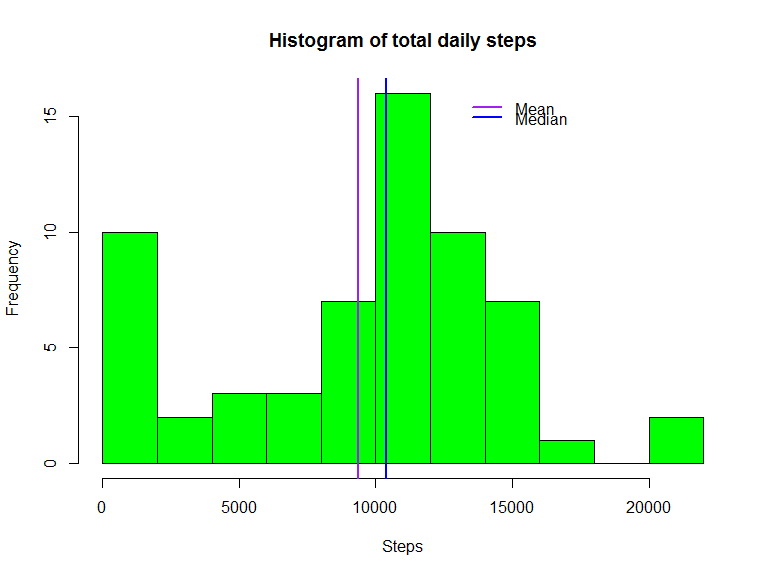

# Reproducible Research: Peer Assessment 1


```r
library(lubridate)
library(dplyr)
library(ggplot2)
library(lattice)
```

## Loading and preprocessing the data

```r
if(!file.exists("activity.csv")){unzip("activity.zip")}
activity <- read.csv("activity.csv", stringsAsFactors = FALSE)
```

## What is mean total number of steps taken per day?

#### 1. Transform date from character to date format and get total steps per day

```r
summaryActivity <- activity %>% transform(date = ymd(date)) %>% group_by(date) %>% summarise(steps = sum(steps, na.rm = TRUE))
```

#### 2. Make a histogram of the total number of steps taken each day 


```r
hist(summaryActivity$steps, col = "green", main = "Histogram of total daily steps",
     xlab = "Steps", breaks = 10)
     
abline(v = mean(summaryActivity$steps), lwd = 2, lty = 1, col = "purple")

abline(v = median(summaryActivity$steps), lwd = 2, lty = 1, col = "blue")

legend(x= 13000, y= 16, lwd = 2, lty = 1, col = c("purple","blue"), legend = c("Mean", "Median"), bty="n", y.intersp = .5)
```

 

#### 3. Report the mean and median of the total number of steps taken per day

##### Mean

```r
mean(summaryActivity$steps)
```

```
## [1] 9354.23
```

##### Median

```r
median(summaryActivity$steps)
```

```
## [1] 10395
```

## What is the average daily activity pattern?

#### 1. Transform date from character to date format and get average steps

```r
summaryInterval <- activity %>% transform(date = ymd(date)) %>% 
    group_by(interval) %>% summarise(steps = mean(steps, na.rm = TRUE))
```
    
    
#### 2. Make a time series plot

```r
with(summaryInterval, plot(interval, steps, type = "l", col = "blue", lwd = 2,
                           main = "Average Number of Steps Taken per Interval",
                           xlab = "Interval in minutes",
                           ylab = "Average Number of Steps"))
```

 
                           
                           
#### 3. Which 5-minute interval contains the maximum number of steps?


```r
filter(summaryInterval, steps == max(steps))
```

```
## Source: local data frame [1 x 2]
## 
##   interval    steps
##      (int)    (dbl)
## 1      835 206.1698
```

## Imputing missing values

#### 1. Calculate and report the total number of missing values in the dataset (i.e. the total number of rows with  NA s)


```r
table(complete.cases(activity))
```

```
## 
## FALSE  TRUE 
##  2304 15264
```

##### Number of missing values are the FALSE count

#### 2. Devise a strategy for filling in all of the missing values in the dataset.

```r
meanStep <- mean(activity$steps,na.rm = TRUE)
```

##### Use the mean value for the missing items 

#### 3. Create a new dataset that is equal to the original dataset but with the missing data filled in.


```r
activityNew <- activity
activityNew$steps[is.na(activityNew$steps)] <- meanStep
```

#### 4. Make a histogram of the total number of steps taken each day and Calculate and report the mean and median total number of steps taken per day

```r
summaryActivityNew <- activityNew %>% transform(date = ymd(date)) %>% group_by(date) %>% summarise(steps = sum(steps, na.rm = TRUE))

hist(summaryActivityNew$steps, col = "green", main = "Histogram of total daily steps",
     xlab = "Steps", breaks = 10)
     
abline(v = mean(summaryActivityNew$steps), lwd = 2, lty = 1, col = "purple")

abline(v = median(summaryActivityNew$steps), lwd = 2, lty = 1, col = "blue")

legend(x= 13000, y= 16, lwd = 2, lty = 1, col = c("purple","blue"), legend = c("Mean", "Median"), bty="n", y.intersp = .5)
```

 

##### Mean

```r
mean(summaryActivityNew$steps)
```

```
## [1] 10766.19
```

##### Median

```r
median(summaryActivityNew$steps)
```

```
## [1] 10766.19
```

##### There is an increase in Mean and Median

## Are there differences in activity patterns between weekdays and weekends?

#### 1. Create a new factor variable in the dataset with two levels -- "weekday" and "weekend"


```r
activity$day <- ifelse(as.POSIXlt(activity$date)$wday %in% c(0,6), "weekend", "weekday")

activity <- transform(activity, day = factor(day, labels = list("weekday", "weekend")))
```

#### 2. Make a panel plot containing a time series plot 


```r
SumActivity <- activity %>% transform(date = ymd(date)) %>% 
     group_by(interval, day) %>% summarise(steps = mean(steps, na.rm = TRUE))
qplot(interval, steps, data = SumActivity, geom = "line", facets = day~.)
```

 
